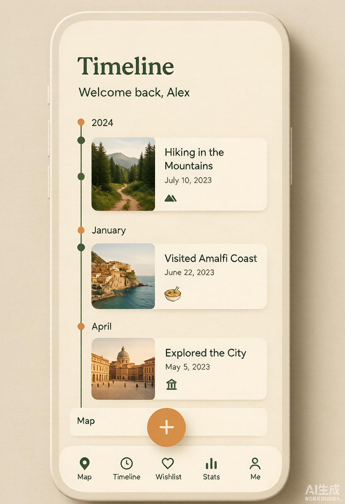
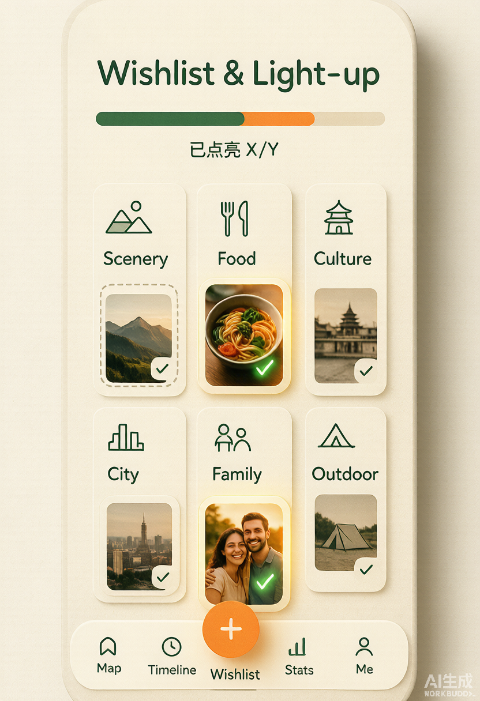
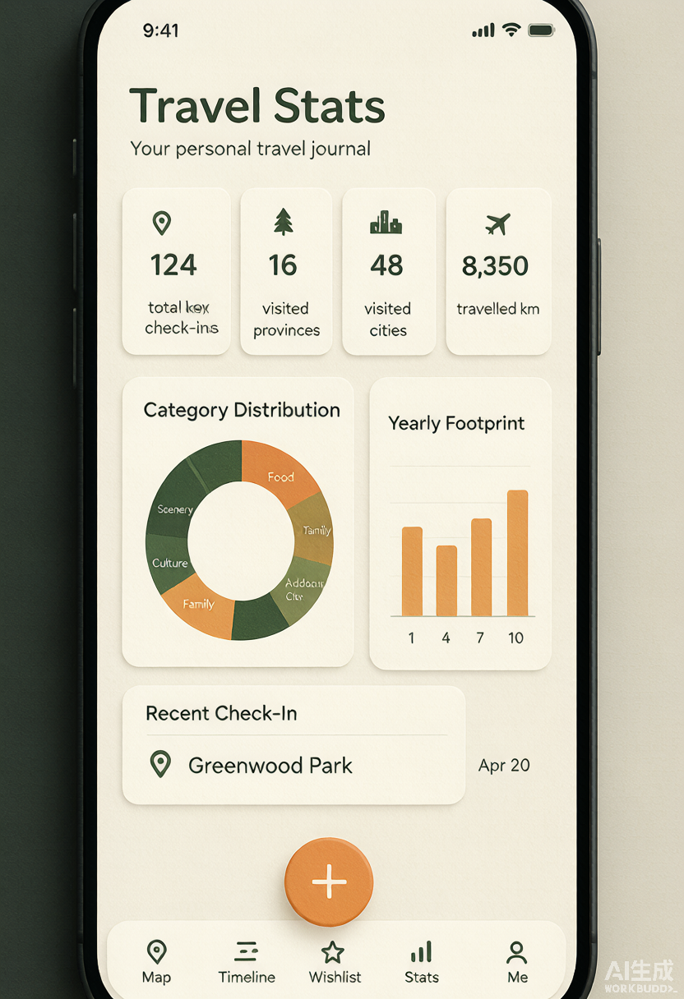
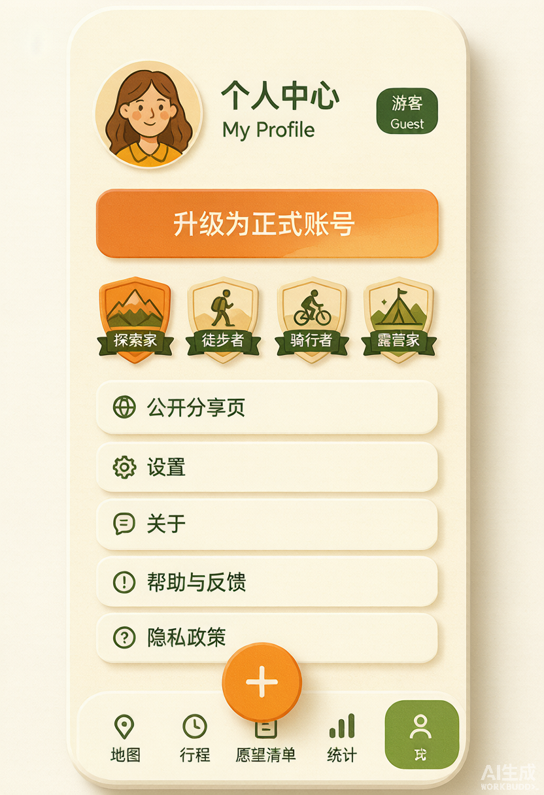
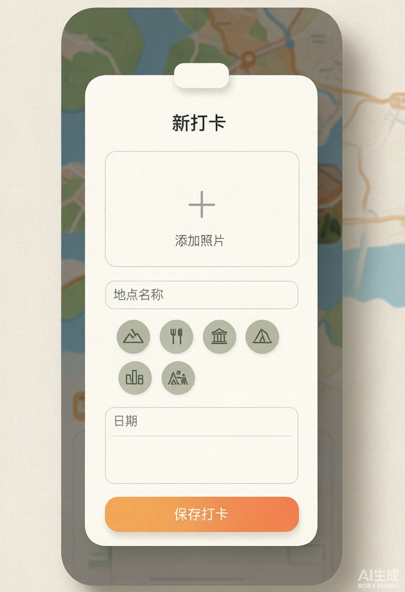
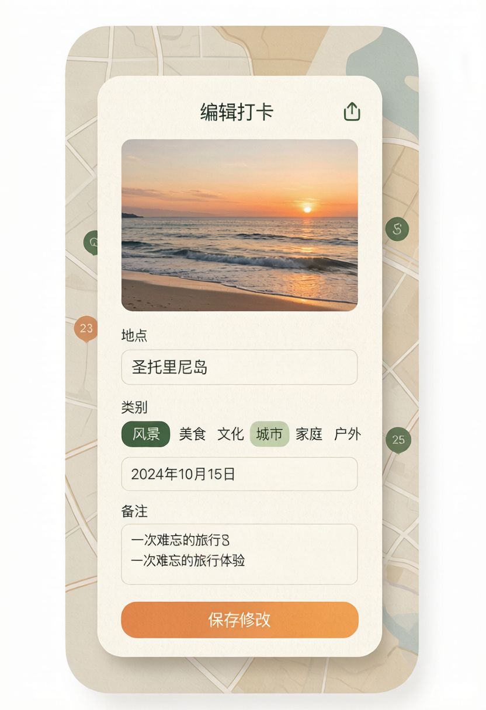
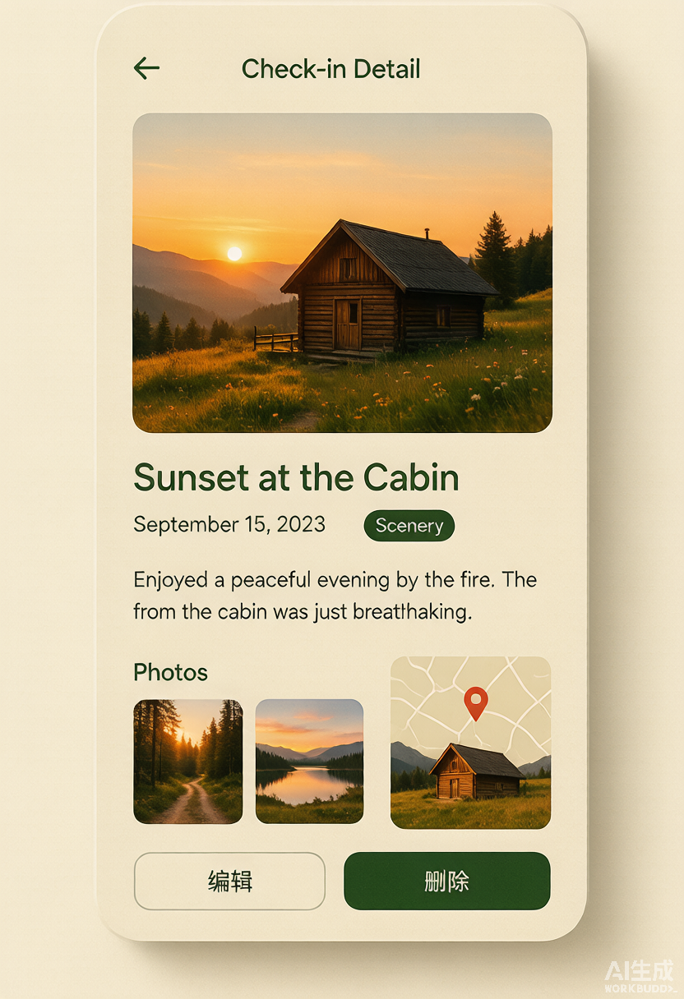
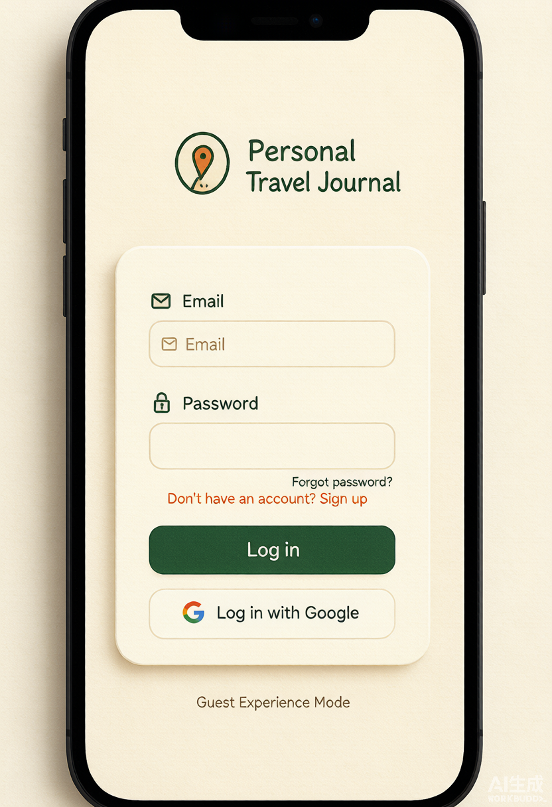
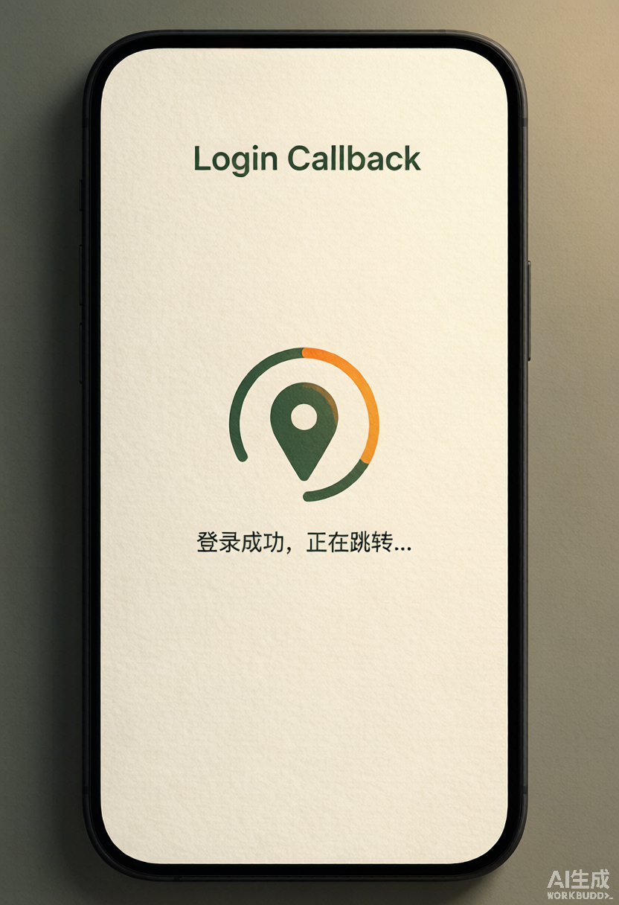
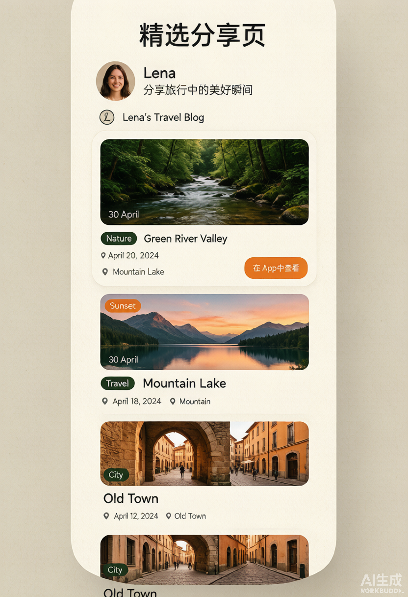

# 旅行打卡地图足迹 · Web 第一期 产品功能

> 旅行手帐风格的「地图 + 时间线 + 统计 + 心愿点亮 + 精选分享」个人足迹应用（第一期 Web 端）。

## 移动端形态（外壳）

应用以移动端为主，桌面预览下居中显示带手机边框的「真机」视图：

- **底部导航 5 模块**：地图 / 时间线 / 心愿 / 统计 / 我的，激活项带滑动高亮（`framer-motion` 共享布局动画），贴屏幕安全区。
- **打卡入口**：位于「心愿」页顶部的橙色「记录打卡」按钮进入新增打卡（`/checkin/new`）；心愿卡片可一键「完成此心愿」原地转为打卡，不打扰其它页面。
- **打卡表单为全屏上滑抽屉**：`/checkin/new` 与 `/checkin/:id/edit` 以底部抽屉（`BottomSheet`）覆盖呈现，带遮罩与拖拽手柄，关闭即返回上一页。
- **地图主页全屏化**：地图铺满视口，顶部分类筛选 chip 悬浮，底部「查看 N 个足迹」按钮唤起身后的足迹列表抽屉。
- **统一滚动容器**：所有页面限制在该手机框内滚动，统计页含环形分类图、分类分布条、年度足迹柱状图与省份点亮进度（纯 CSS/SVG + `framer-motion` 滚动动画）。

## 核心体验

- **地图主页（`/`）**：以交互式地图为中心，按分类（风景/美食/人文/城市/亲子/户外）与状态（已打卡/心愿）筛选；地图大头针按分类着色，点击跳转详情；下方卡片网格展示打卡列表。
- **新增 / 编辑打卡（`/checkin/new`、`/checkin/:id/edit`）**：搜索地点自动获取坐标，填写分类、到访日期、心情文字、评分、标签、照片（上传至对象存储）、是否「精选公开」；心愿与已打卡一键切换。
- **打卡详情（`/checkin/:id`）**：大图、地址、地图定位、心情、标签、评分；本人可编辑/删除/分享。
- **时间线（`/timeline`）**：按月份分组回顾已打卡足迹，心愿单列于底部。
- **旅行统计（`/stats`）**：动态数字统计打卡总数、已去、心愿、去过城市数；分类分布条形图。
- **心愿 & 点亮（`/wishlist`）**：心愿清单按分类筛选；按地址自动提取省级行政区，点亮「去过省份」地图。
- **登录（`/login`）**：邮箱验证码登录/注册、邮箱密码登录（Google 登录在配置 OAuth Relay 后启用）。
- **本地游客模式（无需注册）**：与账号登录完全独立、互不冲突。未登录访问时自动进入游客模式，首页立即展示一组本地示例打卡（覆盖 6 大分类、十余省市），让用户一进来就能看到成型的地图/时间线/统计/心愿。游客可在本机新增、编辑、删除打卡（照片以本地预览存于本会话）；「我的」页标注游客态并引导升级为正式账号。游客数据仅存浏览器本地存储，清空缓存或换设备会丢失，不写入云端、不依赖云端账号。分享页仅正式账号可用。
- **我的（`/me`）**：用户资料、一键开启/关闭分享页、复制分享链接、管理全部打卡。
- **精选分享页（`/share/:publicId`）**：仅公开展示带「精选公开」标记的打卡（按 RLS 行级权限，免登录可读）。

## 增强能力（后续开发）

- **AI 帮我写文案**：新增/编辑打卡时，可根据地点、分类、日期、标签，调用 AI（OpenAI 兼容协议）自动生成一段旅行心情文案并填入表单。通过环境变量 `VITE_AI_API_KEY` / `VITE_AI_BASE_URL` / `VITE_AI_MODEL` 配置，未配置时按钮提示去配置，不影响手动填写。

## 技术要点

- 前端：React 19 + Vite + TypeScript + Tailwind v4 + shadcn/ui + TanStack Query + framer-motion。
- 数据：腾讯云 CloudBase 托管 PostgreSQL，前端 SDK `app.rdb()` 直连，RLS 行级权限（本人可读写、公开打卡匿名可读）。
- 地图：腾讯位置服务 GL API（交互地图）+ WebService（地点搜索 / 坐标解析）。
- 登录：CloudBase Auth v2（匿名游客 / 邮箱验证码 / 密码 / Google OAuth Relay）。
- 设计：暖米纸背景 + 墨绿主色 + 落日橙强调色，圆角卡片、柔和阴影、入场动画。

## 界面预览图（UI 概念图）

> 以下 10 张移动端页面预览图为前端视觉成品基准（与 `产品方案.md` 第 26 节一致），图片存于 `generated-images/`。

- **时间线（`/timeline`）**
  
  竖向时间轴 + 按年/月分组卡片，带照片、地点、日期与分类图标。

- **心愿点亮（`/wishlist`）**
  
  6 大分类分区 + 顶部「已点亮 X/Y」进度条；未点亮灰描边、点亮后彩色发光打勾。

- **统计（`/stats`）**
  
  数据看板（总足迹 / 省 / 市 / 里程）+ 分类占比环形图 + 年份柱状图 + 最近打卡。

- **我的（`/me`）**
  
  头像身份区 + 升级提示条 + 成就徽章 + 分享 / 设置 / 关于菜单。

- **新增打卡（`/checkin/new`，底部抽屉）**
  
  从底部升起的全屏上滑抽屉：照片上传、地点、6 分类选择、日期、备注 + 落日橙保存按钮。

- **编辑打卡（`/checkin/:id/edit`，同抽屉）**
  
  与新增同形态，表单预填已有数据、分类高亮选中、按钮为「保存修改」。

- **打卡详情（`/checkin/:id`）**
  
  独立子页（无底部导航）：封面大图 + 地点 / 日期 / 分类 + 备注 + 照片画廊 + 位置小地图 + 编辑 / 删除。

- **登录（`/login`）**
  
  Logo + 邮箱 / 密码 + 墨绿「登录 / 注册」+ Google 登录 + 底部「游客体验模式」。

- **登录回调（`/auth/callback`）**
  
  极简过渡态：居中品牌加载动画 + "正在登录…"文案。

- **精选分享页（`/share/:publicId`）**
  
  对外公开、无需登录：分享者信息 + 精选打卡卡片流 + 「在 App 中查看」条。

> 地图主页（`/`）样式已在运行环境确认，未单独出图；404 兜底页未纳入。
